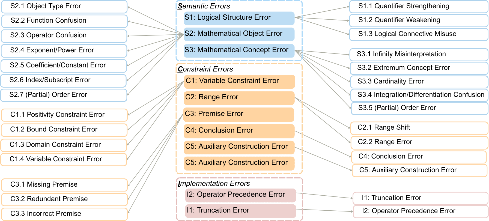

# SCI Error Taxonomy (28 Categories)

Three classification dimensions for formalization errors: **S — Semantic**, **C — Constraint**, **I — Implementation**

---

## S — Semantic *(Mathematical meaning is altered)*

Errors that cause the formal statement to describe something *different* from the original natural language, even if the syntax is valid.

| Code | Canonical Name | Group | Description |
|------|----------------|-------|-------------|
| S1.1 | **Quantifier Strengthening** | Logical Structure Error | The scope of a quantifier is narrowed or made more restrictive than intended (e.g., replacing `∃` with `∀`, or incorrectly restricting the domain) |
| S1.2 | **Quantifier Weakening** | Logical Structure Error | The scope of a quantifier is broadened or made less restrictive (e.g., replacing `∀` with `∃`) |
| S1.3 | **Logical Connective Misuse** | Logical Structure Error | Incorrect use of logical connectives, such as "and" (`∧`) vs "or" (`∨`), equivalence (`↔`) vs implication (`→`), etc. |
| S2.1 | **Object Type Error** | Mathematical Object Error | A mathematical object is assigned the wrong type (e.g., treating a natural number as a real, or a set as a list) |
| S2.2 | **Function Confusion** | Mathematical Object Error | Using the wrong function or misapplying a function (e.g., using `sin` instead of `cos`, applying `f(x,y)` with arguments in wrong order) |
| S2.3 | **Operator Confusion** | Mathematical Object Error | Confusing mathematical operators (e.g., `+` instead of `*`, `mod` instead of `div`, union instead of intersection) |
| S2.4 | **Exponent/Power Error** | Mathematical Object Error | Error in exponent or power expressions (e.g., `x^2` written as `2*x`, or swapping base and exponent) |
| S2.5 | **Coefficient/Constant Error** | Mathematical Object Error | A numeric constant or coefficient is wrong (e.g., `2π` written as `π`, or a coefficient is missing or has the wrong value) |
| S2.6 | **Index/Subscript Error** | Mathematical Object Error | Misreading or swapping index positions (e.g., `a_n` vs `a_{n+1}`, or wrong index of a sequence) |
| S2.7 | **Partial Order Errors** | Mathematical Object Error | Confusion in ordering relations: `<` vs `≤`, `>` vs `≥`, or strict vs non-strict inequalities when defining objects |
| S3.1 | **Infinity Misinterpretation** | Mathematical Concept Error | Error related to limits, divergence, or the concept of infinity (e.g., confusing the limit at infinity with the value at infinity) |
| S3.2 | **Extremum Concept Error** | Mathematical Concept Error | Error in extremum concepts (confusing extremal elements vs bounds like `IsLeast` vs `IsGLB`; wrong max/min direction; local vs global extremum; sup vs max) |
| S3.3 | **Cardinality Error** | Mathematical Concept Error | Misunderstanding the size or cardinality of a set (e.g., using `Finset.card` when `Set.ncard` is needed, or off-by-one counting) |
| S3.4 | **Integration/Differentiation Confusion** | Mathematical Concept Error | Mixing up integration and differentiation (e.g., writing a derivative when the statement requires an integral, or vice versa) |
| S3.5 | **Geometric Relationship/Object Error** | Mathematical Concept Error | Error in selecting or representing geometric objects, relations, or structures (e.g., confusing geometric entities, relations, or the points, lines, angles being referenced) |

---

## C — Constraint *(Conditions / Restrictions are incorrect)*

Errors related to auxiliary conditions — missing, extraneous, or incorrect constraints placed on objects.

| Code | Canonical Name | Group | Description |
|------|----------------|-------|-------------|
| C1.1 | **Positivity Constraint Error** | Variable Constraint Error | Missing or incorrect sign constraints: whether a variable must be positive, negative, non-zero, or non-negative |
| C1.2 | **Bound Constraint Error** | Variable Constraint Error | Variable boundary constraints are wrong (e.g., writing `x ∈ [0, 1]` when `x ∈ (0, 1]` is correct, or reversing lower/upper bounds) |
| C1.3 | **Domain Constraint Error** | Variable Constraint Error | Misidentifying the domain or type of a variable (e.g., treating an integer variable as a real, or wrong element set) |
| C1.4 | **Variable Constraint Error** | Variable Constraint Error | General variable constraint errors not covered by C1.1–C1.3 (e.g., missing conditions that variables must be distinct or independent) |
| C2.1 | **Range Shift** | Range Error | The operating range of an operator (sum, product, integral) is shifted (e.g., sum from `i=0` instead of `i=1`) |
| C2.2 | **Range Error** | Range Error | The start or end point of a summation, product, or integral range is wrong (e.g., upper limit `n` written as `n-1`) |
| C3.1 | **Missing Premise** | Premise Error | A required condition or hypothesis is omitted from the formal statement, making the theorem unprovable or incorrect |
| C3.2 | **Redundant Premise** | Premise Error | An unnecessary or redundant condition is added that the natural language does not require |
| C3.3 | **Incorrect Premise** | Premise Error | A mathematically wrong or internally contradictory condition is introduced |
| C4 | **Conclusion Error** | Conclusion Error | The target statement or final conclusion is formalized incorrectly relative to what the natural language statement requires to be proved |
| C5 | **Auxiliary Construction Error** | Auxiliary Construction Error | Error in defining auxiliary objects (helper definitions, intermediate structures, proof variables) used to support the main statement |

---

## I — Implementation *(Lean 4 encoding errors)*

Errors in the Lean representation — using wrong theorems, wrong APIs, or encodings that do not faithfully reflect the mathematical intent.

| Code | Canonical Name | Group | Description |
|------|----------------|-------|-------------|
| I1 | **Truncation Error** | Implementation Error | Parts of the formal statement are cut off or abbreviated during formalization, resulting in an incomplete Lean 4 expression |
| I2 | **Operator Precedence Error** | Implementation Error | Wrong grouping of terms due to misunderstanding Lean 4 operator precedence rules (e.g., `x * y ^ 2` interpreted as `x * (y ^ 2)` instead of `(x * y) ^ 2`) |

> Full taxonomy is defined in [`pipeline_v2/taxonomy.py`](pipeline_v2/taxonomy.py).
